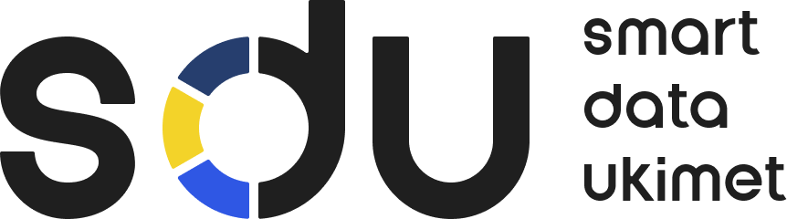

# [Smart Data Ukimet (SDU)](https://www.nitec.kz/en/proekty/smart-data-ukimet)

### Presented by SDU Department, [NITEC JSC](https://www.nitec.kz)  
*For of the Digital Public Goods (DPG) Initiative*

## About Smart Data Ukimet (SDU)

Smart Data Ukimet (SDU) is an advanced information and analytical system developed to revolutionize data-driven decision-making in public administration. Designed in collaboration with the Ministry of Digital Development, Innovations, and Aerospace Industry of Kazakhstan, SDU integrates over 100 databases into a centralized **Data Lake**. This enables comprehensive collection, storage, and analysis of interdepartmental data for a **Data-Driven Government**.

### Key Features:
- **Integrated Data**: Over 100 databases are integrated and synchronized daily into the Data Lake.
- **Depersonalized Data**: Personal and sensitive information is encrypted using SHA-256 protocols for secure and privacy-compliant storage.
- **Proven Solutions**: SDU powers over 20 statistical dashboards for effective governance.
- **Digital Family Card**: Flagship project to monitor and support socially vulnerable families across the nation.
- **Global Recognition**: Ranked **Top 3** in the Open Source Adaptation category at the **Future of Government Awards 2023**, recommended for global use by the UNDP.

### Achievements:
- The most significant case on the Smart Data Ukimet platform is the «Digital Family Card» was honored as the best in the "Inclusive Digital Transformation" category, receiving the prestigious 2024 GovTech Prize.
- Supports decision-making processes with reliable, encrypted, and depersonalized data.
- Facilitates targeted state support with real-time analytics.
- Recognized globally as a model for scalable, open-source solutions in government analytics.

---

## Flagship Projects

### 1. **[Digital Family Card](https://sdu.gov.kz)**

The **Digital Family Card** is a transformative project designed to improve the welfare of families in Kazakhstan by leveraging data-driven insights. This solution integrates information from **20 state databases** to create a comprehensive profile for over **6 million families**, enabling targeted state support.

#### Highlights:
- **100 Indicators** across **30 statuses** are analyzed, including economic, living, health, and social conditions.
- Uses the **Alkire-Foster multidimensional poverty measurement** model in partnership with UNDP.
- Identifies socially vulnerable families for focused government assistance.
- Eliminates bureaucracy:
  - Replaces manual processes and certificate collection with automated data integration.
  - Reduces red tape, queues, and delays for social support.
- **Impact**:
  - Enabled **transparency and efficiency** in social assistance.
  - **Proactively assisted thousands of families**, addressing key issues such as poverty, unemployment, housing, health, and education gaps.

---

### 2. **Proactive Public Services**

Proactive public services extend the capabilities of SDU by delivering state support **automatically**, without requiring citizens to apply manually. This initiative has transformed service delivery in Kazakhstan, making it faster, data-driven, and more inclusive.

#### Key Statistics:
- **3 million+ proactive state services** provided.
- **40 proactive services** implemented, covering critical areas such as disability support, job placement, and family welfare.
- **27,000+ cases** of targeted social assistance delivered without manual applications.
- **65,000+ notifications** sent to job seekers for employment opportunities.
- **12,000+ hot meals** provided for schoolchildren.
- **703,000+ students** exempted from military registration or enlistment obligations.

#### Proactive Services Example:
1. **Social Payment for Disability**:
   - 47,702 lists formed through SDU.
2. **Assistance for Raising a Child with a Disability**:
   - 99,847 beneficiaries identified and supported.
3. **Social Security Payment for Job Loss**:
   - 81,423 beneficiaries.
4. **Disability Allowance**:
   - 125,636 recipients automatically processed.
5. **Payment for Loss of a Breadwinner**:
   - 4,149 cases addressed proactively.

---

## Tools for Data Analytics

The SDU infrastructure includes a robust stack of analytics tools for efficient data handling and visualization:

### 1. **ClickHouse**
A column-oriented database designed for high-performance analytics.
- **Primary Use**: Real-time big data processing.
- **Strengths**: Speed, scalability, and optimized for large-scale analytics workloads.

### 2. **Apache Superset**
An intuitive data visualization platform for interactive dashboards.
- **Primary Use**: Dashboards and BI for data-driven insights.
- **Strengths**: Open-source, user-friendly, and customizable.

### 3. **Apache Airflow**
A workflow orchestration tool for managing and automating complex data pipelines.
- **Primary Use**: Scheduling and monitoring data workflows.
- **Strengths**: Scalability, flexibility, and compatibility with modern data ecosystems.
